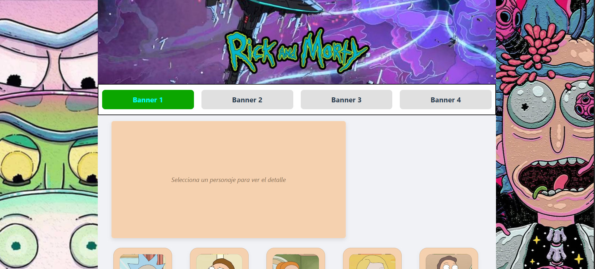
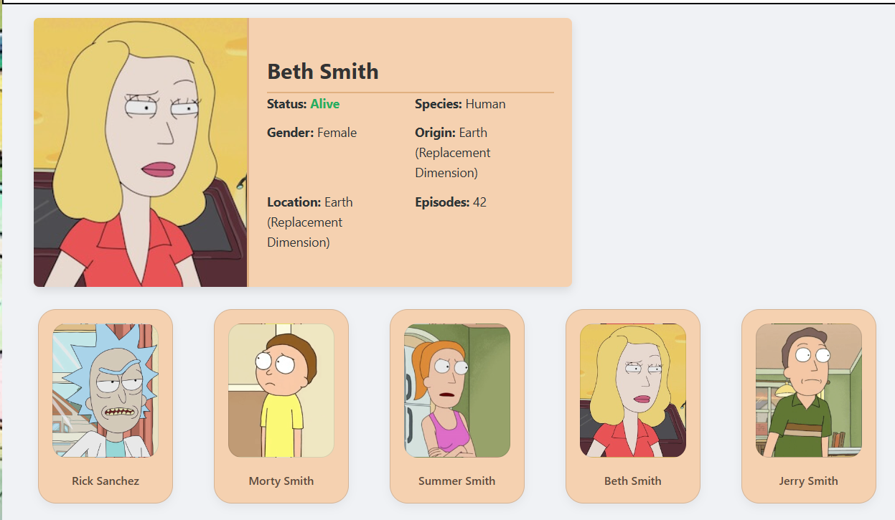
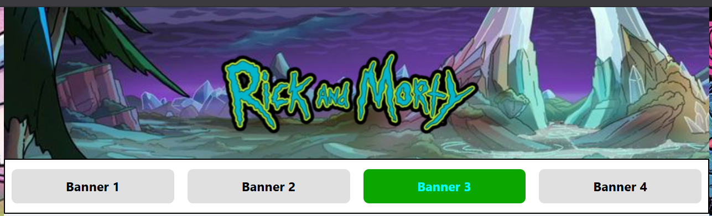

# Proyecto de Practica 

## Objetivo Real y conclusion general 
El proyecto "react_project" fue un proyecto destinado única y exclusivamente a familiarizarme con el stack tecnológico REACT.
Este proyecto fue desarollado con la única intencion de desenvolverme en 4 funciones generales que me acompañaran mas adelante.

- Uso de Hooks:Concretamente hice un uso sencillo de useState, useEffect. 
- Uso de props: El sistema de intercambiar datos de padre a hijo y de hijo a padre. 
- Uso de api: Fue mi primer acercamiento con la lectura de un api, posteriormente me fuie familiarzando con la lectura de jsons.

El proyecto fue construido con un nivel de JavaScript promedio apenas habia comenzado a entender los arrow functions, asincronias 
promesas y jsons. Por eso este projecto no da más de si, cumplio su fúncion. Funcion que me llevara posteriormente a desarollar
mejores stacks, y por puesto implementar backend. 

Este acercamiento fue el pilar y el comienzo de lo que posteriormente desarrollaría 
con gestoriaV2, proyecto que a su vez me llevó a construir [MizumeBlog](https://mizumeblog.es/).

;

;

;